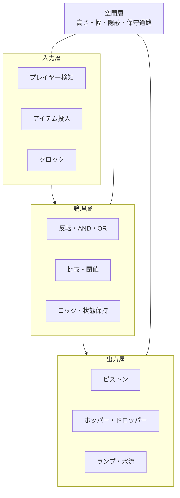
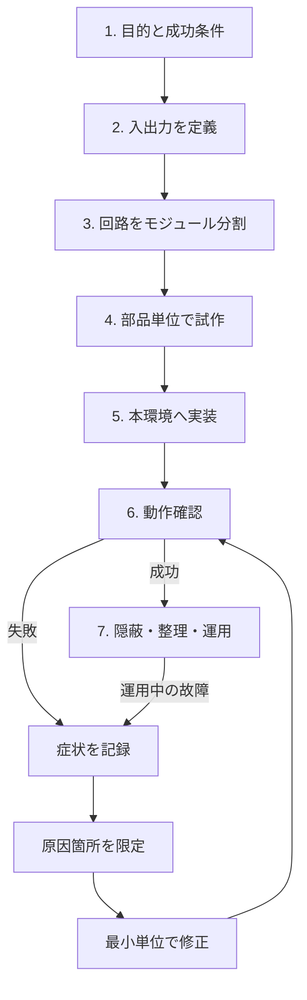
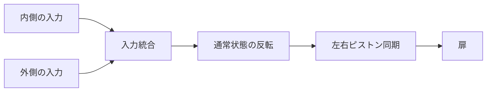
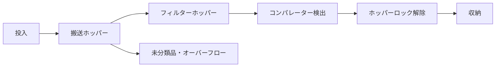
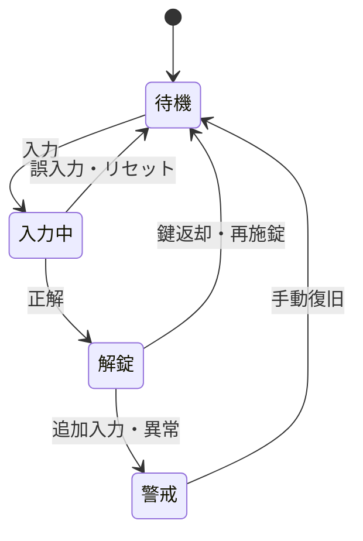
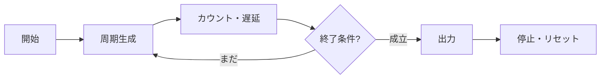
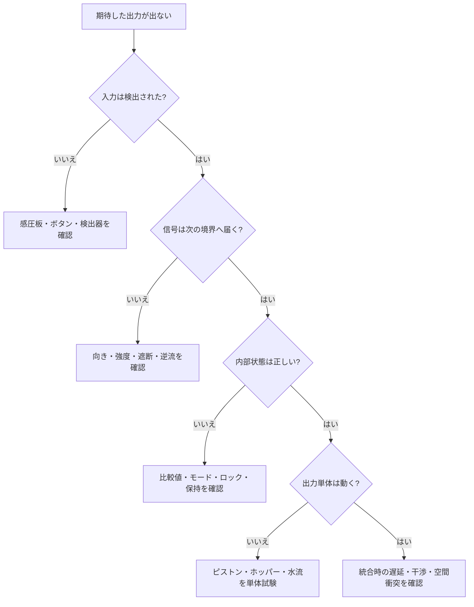

Minecraftのレッドストーン回路は、部品の置き方を覚えるだけでも楽しめます。しかし、自動ドアを大きくしたり、自動仕分け機を倉庫へ組み込んだりした瞬間、問題は「レシピどおりに置く」だけでは解けなくなります。

- どこから入力を受け、何を出力するのか
- 信号はどの経路を通るのか
- 状態や時間をどこに保持するのか
- 建築の中へどう収めるのか
- 動かなかったとき、どこから調べるのか

この記事では、こうした設計・実装・試験・修正の全体を **レッドストーン工学** と呼ぼうと思います。

公開されているMinecraft配信から、自動ドア4件、アイテム仕分け機4件、パスワード／タイマー回路4件の計12事例、約929分を予備的に観察しました。確認して分かったことは、うまい人ほど一発で完成させるのではなく、**回路を分けて考え、小さく試し、原因を限定して直している**ということでした。

:::message
この記事は特定バージョン用のブロック配置レシピではなく、Java版・Bedrock版を問わず応用できる開発プロセスを扱います。細かな挙動は対象エディションとバージョンで必ず再確認してください。
:::

## レッドストーン回路を「システム」として見る

最初に回路を、部品の集合ではなくブラックボックスとして定義します。


たとえば自動ドアなら、いきなりピストンを置く前に次を決めます。

|項目|定義例|
|---|---|
|入力|内外どちらの感圧板でも反応する|
|通常状態|扉は閉じている|
|出力|2枚の扉が同時に開き、通過後に閉じる|
|制約|床下3ブロック以内、壁から回路を露出させない|
|異常時|片側だけ開く、閉じない、連打で状態がずれる|

この5項目が曖昧なまま作り始めると、「回路は動くが欲しかった装置ではない」という失敗が起きます。

## 回路はモジュールに分ける

複雑な装置も、役割で分解すると調べやすくなります。



ここで重要なのが、論理回路とは別に **空間層** を置くことです。Minecraftでは、論理的に正しい回路でも、壁、床、隣の配線、既存設備と干渉すれば動きません。

回路図と建築図を分けて考えると整理しやすくなります。

1. 平らな試験場で機能だけを成立させる
2. 入出力位置を固定する
3. 必要な高さ・幅・保守スペースを測る
4. 本設置場所へ移植する
5. 最後に隠蔽と装飾を行う

## 開発は一直線ではなくループする

観察した12事例では、要求、実装、試験、修正を何度も往復していました。実用的な流れは次のとおりです。



大事なのは、失敗したら全部壊すのではなく、**最後に正常だった境界**まで戻ることです。ソフトウェア開発でいう単体テストや二分探索に近い考え方です。

## 4種類の回路を工学的に読む

### 1. 自動ドア：論理より先に空間が壊れる

自動ドアは単純に見えますが、実際には次の4モジュールを持ちます。



難所は、ピストンの向き、左右反転、信号の到達だけではありません。天井高、床下配線、扉の厚さ、回路を隠す壁の奥行きまで同時に決める必要があります。


*引用: 海汐もるふ「[【Minecraft】自動ドアが作りたい！！【海汐もるふ/Varium】](https://www.youtube.com/watch?v=vIfqrdigUHY&t=4648s)」1:17:28頃。上段機構を含む構造を確認している場面。*

自動ドアでは、最初から狭い本設置場所で粘るより、地上に同じ片側回路を作って原理を確認してから戻す方が、問題を「回路」と「空間」に分離できます。

### 2. アイテム仕分け機：値と物流を同時に設計する

仕分け機は、信号回路だけでなくアイテムの流れを扱います。



設計時に決めるべきものは、仕分け対象、フィルター用アイテム、閾値、未分類品の出口、満杯時の挙動です。正常時だけでなく、「チェストが満杯」「対象外アイテムが来る」「大量投入される」も入力として扱います。


*引用: 石田ニコル「[【マイクラ】アイテム自動仕分け機作るよ生配信！](https://www.youtube.com/watch?v=Hh73KYb4TwQ&t=2143s)」35:43頃。フィルターホッパーの内容を設定している場面。*

仕分け機の完成条件は「1個だけ仕分けられた」では足りません。最低でも次を試します。

- 対象アイテムを1個投入する
- 対象アイテムを1スタック投入する
- 対象外アイテムを混ぜる
- 出力チェストを満杯に近づける
- 隣接フィルターへ信号が漏れないか確認する

### 3. パスワード回路：状態機械として考える

パスワード回路は、組み合わせ回路ではなく状態を持つ装置です。



「正しい入力で開く」だけでなく、誤入力、途中入力、連打、鍵の返却、再施錠まで決めて初めて仕様になります。


*引用: 空戸吹あひる「[【マイクラ】鍵付きドア制作！！回路勉強中。](https://www.youtube.com/watch?v=Fo9WqL_4BS8&t=9282s)」2:34:42頃。鍵判定モジュールの成立を確認する場面。*

パスワード回路では、認証部分とドア部分を先に分離して試します。認証成功をいったんランプへ出力し、安定した後でドアへ接続すると、故障箇所を限定できます。

### 4. タイマー：時間ではなく条件を測る

タイマーで本当に必要なのは「30秒」ではなく、「水が末端へ届くまで」「10回出力したら」「夜になったら」のような成功条件です。




*引用: Bacchi-MinecraftBedrock「[【マイクラ統合版】【LIVE】カウントダウン回路作ろうぜ](https://www.youtube.com/watch?v=68Y19Azm8xQ&t=1416s)」23:36頃。周期生成と信号保持列を接続している場面。*

タイマーは単体で正しい周期でも、出力装置へ接続すると逆流や遅延差が出ます。実環境で測り、部品数ではなく結果に合わせて校正します。

## どこが壊れやすいのか

12事例で観察できた誤動作を分類すると、最多は信号経路と空間配置でした。


この集計は、公開配信の映像と自動字幕を用いた単独コーダーによる予備分析です。同じ事例に複数の分類を付けており、画面上だけで行われた無言の試験や修正は数え切れていない可能性があります。厳密な発生率ではなく、デバッグ時に確認すべき範囲の広さとして読んでください。

向きの間違いは目立ちますが、それだけを直しても解決しないことがあります。調査順序は、見た目ではなく信号の流れに沿わせます。



デバッグでは、レッドストーンランプや一時的なトーチを「観測点」として挟むと便利です。

```text
入力 ── [観測点A] ── 論理 ── [観測点B] ── 状態 ── [観測点C] ── 出力
```

Aまで届くがBへ届かないなら論理部、Cまで届くが装置が動かないなら出力部、というように探索範囲を狭められます。

## テストは3段階に分ける

### 部品テスト

- リピーターの向きと遅延
- コンパレーターのモードと出力強度
- ホッパーの接続先とロック状態
- ピストンが押せるブロックと必要空間

### モジュールテスト

- 入力をランプへ接続して検出だけを確認
- 認証成功をドアではなくランプへ出力
- 仕分け列を1列だけ作る
- タイマーを出力装置から切り離して周期を測る

### 統合・運用テスト

- 両側から連続入力する
- 大量投入、満杯、対象外アイテムを試す
- 再ログインやチャンク再読み込み後に確認する
- 隣の回路を同時に動かす
- 外装を閉じた状態で保守できるか確認する

「一度動いた」は試作成功です。運用成功には、繰り返し、境界値、異常入力、周辺設備との同時動作が必要です。

## そのまま使える設計シート

回路を作る前に、次を看板、本、メモへ書き出します。

```markdown
# 装置名

## 目的
- 誰が、何のために使うか:

## 入出力
- 入力:
- 出力:
- 通常状態:
- リセット条件:

## 成功条件
-

## 異常条件
- 連打:
- 満杯:
- 対象外入力:
- 停電・信号断:

## モジュール
- 入力検出:
- 論理・比較:
- 状態・時間:
- 出力:
- オーバーフロー／非常停止:

## 空間
- 幅 × 高さ × 奥行き:
- 回路を開ける保守面:
- 隣接回路との距離:

## テスト記録
- 入力:
- 期待結果:
- 実際の結果:
- 最後に正常だった観測点:
- 変更した部品:
```

変更は一度に1種類だけ行います。複数箇所を同時に変えると、直った理由も新しく壊れた理由も分からなくなります。

## レッドストーン工学の7原則

1. **目的を出力で書く**: 「回路を作る」ではなく「誰が何をすると何が起きる」。
2. **通常状態を決める**: 無入力時、満杯時、再起動時の状態を決める。
3. **機能と空間を分ける**: 平地の試作と建築への統合を別工程にする。
4. **モジュール境界を作る**: 入力、論理、状態、出力を単独で試せるようにする。
5. **信号を観測する**: 推測で壊さず、どこまで届いたかを確認する。
6. **異常入力を先に考える**: 連打、満杯、誤入力、対象外、処理落ちを試す。
7. **完成後も触れるようにする**: 保守通路、予備スペース、ラベルを残す。

## おわりに

レッドストーン回路の面白さは、完成品だけでなく、曖昧な目的を信号とブロックへ変換する過程にあります。

回路が動かないとき、それは「レッドストーンが難しい」で終わる問題ではありません。入力、信号、状態、出力、空間のどこで期待と現実が分かれたかを探せば、次に試すことを決められます。

**作る、測る、分ける、直す。**

この反復を意識した瞬間から、レッドストーンはレシピの模倣ではなく、設計可能な工学になります。

## 参考動画

- [海汐もるふ「【Minecraft】自動ドアが作りたい！！【海汐もるふ/Varium】」](https://www.youtube.com/watch?v=vIfqrdigUHY)
- [石田ニコル「【マイクラ】アイテム自動仕分け機作るよ生配信！」](https://www.youtube.com/watch?v=Hh73KYb4TwQ)
- [空戸吹あひる「【マイクラ】鍵付きドア制作！！回路勉強中。」](https://www.youtube.com/watch?v=Fo9WqL_4BS8)
- [Bacchi-MinecraftBedrock「【マイクラ統合版】【LIVE】カウントダウン回路作ろうぜ」](https://www.youtube.com/watch?v=68Y19Azm8xQ)

:::message alert
動画画像は回路制作プロセスの批評・分析に必要な範囲を静止画として引用し、出典と時刻を各画像直下に記載しています。各動画・キャラクター・ゲーム画面の権利は、それぞれの権利者に帰属します。公開前に、各配信者の切り抜き・画像利用ガイドラインとMinecraft Usage Guidelinesを確認してください。
:::
