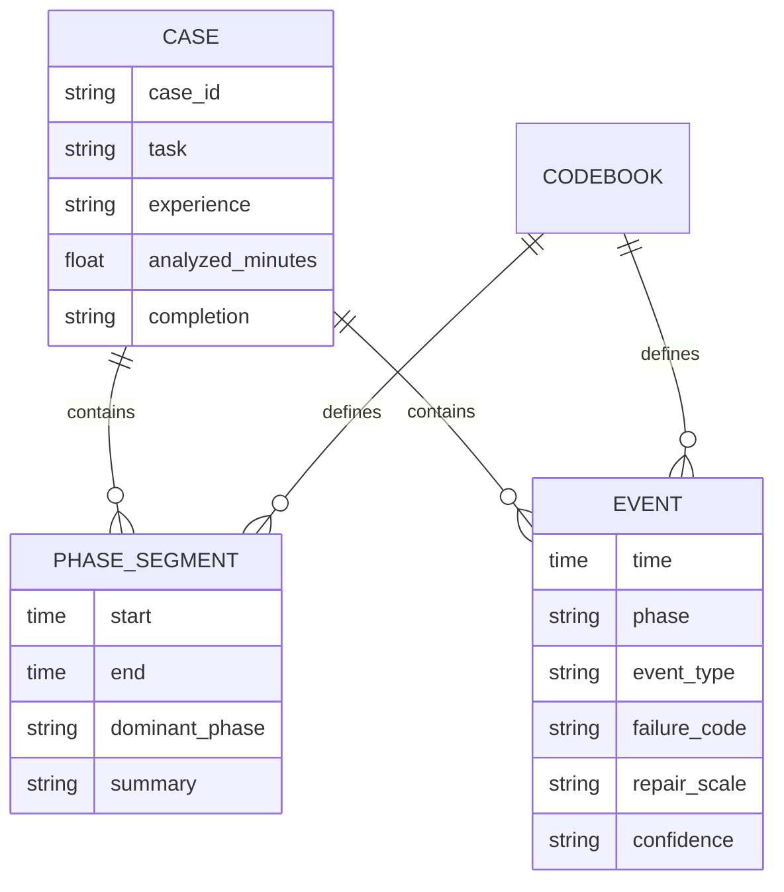
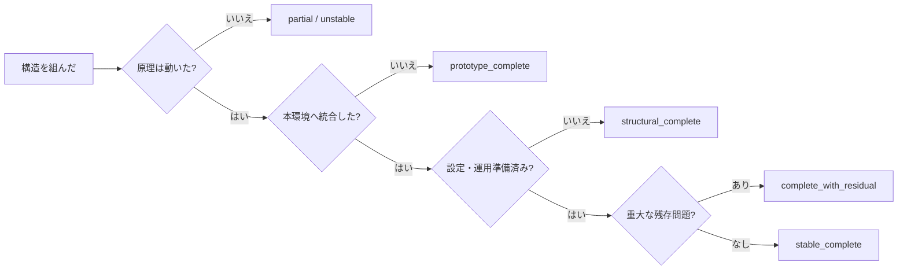

前の記事「[レッドストーン工学入門](https://zenn.dev/comsan4510/articles/redstone-engineering)」では、Minecraftのレッドストーン回路を、要求定義、モジュール設計、試験、デバッグを含む工学プロセスとして整理しました。

では、そのモデルをどうやって作ったのか。

この記事では、公開されているMinecraft配信アーカイブから、自動ドア、アイテム仕分け機、パスワードロック、タイマー回路の制作過程を抽出し、**12事例・約15時間29分**を分析した手順を公開します。

最終的に作成したデータは次の4層です。

- 12件の事例別集計
- 97件の工程区間
- 131件の主要イベント
- 工程・誤動作・修正規模を定義したコードブック

:::message
これは公開動画を使った単独コーダーによる予備分析です。統計的一般化や配信者個人の能力評価を目的としたものではありません。
:::

## なぜ公開配信を調べたのか

完成した回路だけを見ても、開発プロセスは分かりません。

編集済みのチュートリアルでは、材料、完成構造、正しい配置は分かります。一方で、次の出来事は編集で省かれやすくなります。

- 何を作るか迷う
- チュートリアルの説明を誤解する
- 部品の向きや高さを間違える
- 動かない原因を探す
- 一部を壊して作り直す
- 回路は動くが建築へ入らない
- 完成後に詰まりや同期ずれが起きる

長時間配信には、こうした「うまくいかなかった時間」も残ります。レッドストーン開発を工学プロセスとして調べるには、完成品よりも試行錯誤の記録が重要でした。

ただし、公開配信は実験データではありません。話者、課題、ゲーム環境、視聴者コメント、編集方針を統制できないため、今回は**探索的な事例分析**として位置づけました。

## 調査全体の流れ


重要なのは、字幕から直接結論を出さないことです。

字幕は「45分頃に動かないと言っている」と探すための索引として使い、意味の判定は映像、前後の発話、画面上の操作を合わせて行いました。

## 1. 検索語を装置名だけにしない

最初に「マイクラ 自動ドア 配信」だけで検索すると、短いチュートリアルや完成紹介に偏りました。そこで、装置名、利用場面、故障、学習状況を組み合わせました。

|軸|検索語の例|
|---|---|
|装置|自動ドア、自動扉、ピストンドア、自動仕分け、鍵付きドア、タイマー|
|利用場面|玄関、拠点入口、倉庫、収穫装置、カウントダウン|
|故障・保守|動かない、詰まり、修理、作り直し、リベンジ、完成|
|学習過程|初心者、初レッドストーン、回路勉強会、研究、試作|
|規模・統合|巨大、全アイテム、地下、既存建築、サーバー|

自動ドア調査では重複を含む300件超、仕分け機調査では400件超の検索結果枠を確認しました。これはユニーク動画数ではなく、複数の検索語で表示された結果の延べ確認数です。

検索段階では「採用／不採用」だけでなく、次を候補CSVへ残します。

```csv
video_id,title,creator,published_at,duration,task,caption,priority,notes
vIfqrdigUHY,自動ドアが作りたい,海汐もるふ,2024-11-08,05:19:50,automatic_door,yes,high,長時間デバッグ
Hh73KYb4TwQ,アイテム自動仕分け機作るよ生配信,石田ニコル,2024-12-01,01:17:10,item_sorter,yes,high,短時間で工程が完結
```

不採用候補を残すのは、後から選定基準を説明するためです。「良さそうな動画だけを覚えておく」方法では、選択バイアスを検証できません。

## 2. 字幕を全文読まず、区間の索引にする

長時間配信を先頭から順番に見ると、候補選定だけで時間を使い切ります。そこで日本語自動字幕が取得できる動画では、先に語句と時刻を検索しました。

調査時に有効だった語句は装置ごとに異なります。

```text
共通: 回路 / 信号 / 動かない / 違う / 直す / 完成 / できた
ドア: ピストン / 感圧板 / 開かない / 閉じない / 反対
仕分け: ホッパー / コンパレーター / 18個 / 41個 / 詰まり
パスワード: 鍵 / 正解 / 比較 / リセット / 返す
タイマー: 遅延 / 秒 / クロック / 停止 / 速い / 遅い
```

字幕取得の一例です。

```bash
yt-dlp \
  --write-auto-subs \
  --sub-langs "ja.*" \
  --skip-download \
  "https://www.youtube.com/watch?v=VIDEO_ID"

rg -n "動かない|違う|やり直|完成|信号|ピストン" *.vtt
```

:::message alert
動画・字幕の取得や利用は、YouTubeの利用規約、配信者のガイドライン、著作権、所属機関の研究倫理方針を確認した上で行う必要があります。
:::

自動字幕には、「回路」が「海路」、「コンパレーター」が「コンプレッサー」、「仕分け」が「仕訳」になるような誤認識があります。そのため完全一致検索だけではなく、周辺語、表記揺れ、装置固有の数字も使いました。

自動ドアで33本、仕分け機で36本について字幕から時刻を確認できました。パスワード／タイマー群も別途候補を調べましたが、字幕の有無や自然な制作過程が残っているかには大きな差がありました。

## 3. 分析区間を決める

動画全体ではなく、要求、実装、試運転、修正を連続して観察できる区間を切り出しました。

### 区間開始の目印

- 作る装置や目的を宣言する
- 設置場所を決める
- 必要部品を並べ始める
- 前回の失敗を説明して再開する

### 区間終了の目印

- 完成や主機能の成立を確認する
- 装飾や別作業へ完全に移る
- 未完成のまま配信区間が終わる
- 問題が解消しない状態で作業を打ち切る

字幕が示した時刻の前後2〜3分を映像で確認し、実際の工程境界へ修正します。たとえば「できた」という発話があっても、直後の試験で壊れれば完成ではありません。

選定した12事例は、課題と開発状況が偏りすぎないようにしました。

|課題|事例数|分析時間|特徴|
|---|---:|---:|---|
|自動ドア|4|283.6分|初心者、既存建築、大型化|
|アイテム仕分け機|4|425.2分|短時間制作、再挑戦、原理学習|
|パスワード／タイマー|4|220.1分|初心者、熟練者、状態・時間制御|

これは無作為抽出ではなく、工程を観察できる事例の**目的抽出**です。したがって「Minecraftプレイヤー全体の平均」を推定するデータではありません。

## 4. コードブックを先に作る

映像を見ながら自由記述だけを続けると、同じ場面を後から違う名前で分類してしまいます。そこで、分析前に工程コードを操作的に定義しました。

|コード|工程|判定基準の要約|
|---|---|---|
|REQ|要求理解|何を作り、何を解決するかを述べる|
|IO|入出力定義|感圧板、鍵、アイテム、時間、扉などを決める|
|ARCH|回路構造|機能を部分へ分け、信号経路を検討する|
|PROTO|部品試作|本設置と別の小規模構成で試す|
|SPACE|空間配置|高さ、幅、隠蔽、既存建築との干渉を扱う|
|IMPL|実装|部品を配置し、配線する|
|TEST|動作確認|入力を与え、結果を確認する|
|FAULT|誤動作発見|期待と異なる状態を認識する|
|DIAG|原因特定|向き、信号、設定、遅延などを調べる|
|FIX|修正|置き直し、設定変更、部分解体を行う|
|REFINE|整理|隠蔽、保守性、小型化、外観を改善する|
|CFG|設定調整|フィルター、比較値、アイテム数などを設定する|

`CFG`は当初の工程表にはありませんでした。仕分け機や状態回路では「18個を入れる」「コンパレーターを減算モードへ変える」のような作業が頻出し、単なる実装と分けた方が分析しやすかったため追加しました。

コードブックは固定された正解ではありません。実データで区別できない分類は統合し、繰り返し現れる重要な作業は追加します。ただし、変更理由と適用範囲は記録します。

## 5. 二段階でコーディングする

今回の分析では、工程区間とイベントを分けました。



### 第一段階：支配的工程で区間を分ける

連続する時間を、その区間で最も支配的だった工程へ割り当てます。

```csv
case_id,start,end,dominant_phase,summary
AD2,00:39:56,00:46:55,PROTO,地上に移して同じ構造を試作
AD2,00:46:55,00:55:36,TEST,試作の動作とリピーターの役割を確認
AD2,00:55:36,01:17:30,FIX,向きと信号経路を修正しながら再実装
```

数秒単位でコードを切り替えると、細かすぎて全体構造が見えなくなります。区間データは「この10分間の主目的は何だったか」を表します。

### 第二段階：工程を変えた出来事を記録する

誤動作、診断、修正、試験成功などは、時刻付きイベントとして別に記録します。

```csv
case_id,time,phase,event_type,failure_code,repair_scale,description,confidence
IS1,00:39:04,FAULT,fault,ORI,partial,ホッパー方向が違い機能していないと判明,high
IS1,00:40:40,FIX,correction,ORI,partial,該当列をやり直す,high
IS1,00:47:21,TEST,test,,,アイテムが途中まで流れることを確認,high
```

区間とイベントを分けることで、時間配分と出来事の回数を混同せずに済みます。「誤動作の発見」は数秒でも、その原因特定と修正には20分かかることがあります。

## 6. 誤動作と修正規模を別軸にする

誤動作は次の8種類に分類しました。

|コード|分類|例|
|---|---|---|
|ORI|向き・配置|ピストン、リピーター、ホッパーの逆向き|
|SIG|信号経路・強度|届かない、余計な場所へ届く、ロックが外れない|
|SPA|空間・干渉|高さ違い、スペース不足、既存建築との衝突|
|CFG|設定・状態|比較モード、フィルター数、保持状態|
|TIM|遅延・同期|速すぎる、止まらない、左右がずれる|
|DES|設計不整合|異なるチュートリアルを混ぜる、方式選択を誤る|
|INT|統合・出力|単体は動くがドアや水流へ接続すると失敗する|
|ENV|環境・偶発|処理落ち、資材不足、作業中の破壊|

さらに、修正規模を次の3段階で記録しました。

1. **局所修正**: 1〜数部品、短い配線、設定値を変更
2. **部分再構築**: 片側、1段、1列、1モジュールを作り直す
3. **全体再設計**: 方式や配置前提を変え、大部分を解体する

「何が壊れたか」と「どれほど戻ったか」を分けることで、同じ向きの誤りでも、部品1個で済んだケースと列全体を作り直したケースを区別できます。

## 7. 集計は下限値として扱う

最終的な予備集計は次のとおりです。

- 分析時間: 928.9分
- 工程区間: 97件
- 主要イベント: 131件
- 明示的な試運転: 59回
- 明示的な誤動作: 67件
- 戻り作業: 51回
- 方式や全体に及ぶ大きな作り直し: 4事例


動作確認、原因特定、修正を合計すると282.0分、全体の30.4%でした。ただし、これは「開発時間の正確な30.4%がデバッグ」という意味ではありません。

字幕や発話から独立した出来事として区別できた最小値であり、次は数え切れていない可能性があります。

- 無言でレバーを操作した試験
- 画面上だけで行った部品の置き直し
- 字幕が付かなかった短い発話
- 配信外で行われた調査や試作
- 雑談と同時に進んだ設計判断

そのため、回数は絶対値よりも、課題間の傾向や、どの種類の問題が広く現れたかを見るために使いました。

## 8. 完成状態も段階で記録する

配信者が「完成」と言っても、分析上の完成状態は分けました。



たとえば仕分け機では、回路構造が完成しても、各列へのフィルター登録が終わっていなければ運用開始できません。タイマーでは、単体周期が正しくても、水流や表示装置へ統合した後に遅延差が出ることがあります。

「組み上がった」と「運用可能」を分けることは、レッドストーン以外のプロトタイプ評価にも使える考え方です。

## 9. うまくいかなかった調査方法

### 動画を最初から全部見る

候補選定の段階では非効率でした。字幕と概要欄で区間候補を作り、採用候補だけ映像を精査する方が現実的です。

### 自動字幕だけで操作を確定する

「違う」と発話していても、部品の向きが違うのか、参照画像が違うのか、設置場所が違うのかは字幕だけでは分かりません。字幕は検索用、分類は映像用と役割を分けました。

### すべてを直線工程へ押し込む

当初は「要求→設計→実装→試験→完成」という直線を想定していました。しかし実際には、試験から回路構造へ戻るループと、空間配置へ戻るループが別々に現れました。

### 発話の回数をそのままイベント数にする

「動かない」を連続して数回言っても、同じ症状を指していれば1イベントへ統合しました。発話数ではなく、工程遷移を生む出来事を単位にしました。

### 配信者の熟練度を成績として扱う

熟練度は自己申告や配信内容からの相対的な分類です。能力評価ではなく、問題の分解方法を比較する補助変数としてのみ使いました。

## 10. 妥当性と倫理上の限界

この調査には明確な限界があります。

1. 自動字幕の誤認識がある
2. 無言操作を完全には記録できない
3. 配信形式、課題、熟練度が交絡している
4. ワールドデータがなく、完成構造を独立検証できない
5. 単独コーダーで、コーダー間一致度を測定していない
6. 視聴者コメントや共同制作者からの支援量が異なる

また、公開されていることと、自由に研究利用・転載できることは同義ではありません。

- 動画や静止画の著作権
- 各配信者・所属組織の切り抜きガイドライン
- YouTubeの利用規約
- 引用の必要性と主従関係
- 発話者名を出す必要性
- 所属機関の倫理審査や研究方針

今回の記事では、調査方法の説明に必要な範囲で動画リンクと事例名を示しています。人物の優劣や失敗を評価する目的ではなく、公開された制作プロセスの構造を分析対象にしています。

## 11. 次に正式研究へ進めるなら

予備分析から、次の改善点が見えました。

- 全イベントの前後2〜3分を再確認する
- データの20〜30%を第二コーダーが独立分類する
- Cohenのκなどで分類一致度を確認する
- Java版／Bedrock版、参照資料の有無、経験を記録する
- 発話イベントと画面操作イベントを分離する
- ワールドデータから部品数、体積、回路深度を測定する
- 同一参加者へ複数課題を実施し、課題差と熟練度差を分ける

特に重要なのは第二コーダーです。コードブックが詳しくても、別の人が同じ映像を同じように分類できなければ、分類の再現性は確認できません。

## 12. 再利用できる最小成果物

同種の調査を行うなら、最終レポートだけでなく次を残すと再分析しやすくなります。

```text
archive_candidates.csv   # 候補と不採用理由
coding_manual.md         # 工程・誤動作・完成状態の定義
case_summary.csv         # 事例単位の属性と集計
phase_segments.csv       # 開始・終了時刻付きの工程区間
event_log.csv            # 試験・誤動作・診断・修正イベント
analysis_report.md       # 集計方法、解釈、限界
```

分析結果よりも、**どの動画の、何分何秒を、どの定義で分類したか**を残すことが重要です。結論に疑問が出たとき、元の映像と判断根拠へ戻れるからです。

## おわりに

公開配信は、完成品の紹介では失われる試行錯誤を観察できる貴重な資料です。一方で、長時間、字幕誤認識、選択バイアス、倫理と著作権という難しさがあります。

今回もっとも有効だったのは、次の役割分担でした。

1. 検索語を広げて候補を落とさない
2. 字幕を時刻索引として使う
3. 映像で意味と工程境界を確認する
4. 工程区間とイベントを分ける
5. 数値を下限値として解釈する
6. コードブックと根拠時刻を残す

Minecraftの配信を見ていたはずが、最後に残ったのは、要求分析、モジュール化、テスト、デバッグ、保守という開発プロセスのデータでした。

「何が完成したか」だけでなく、「どう迷い、どこで壊れ、どう戻ったか」を記録すると、ゲーム内の制作も分析可能な工学活動として見えてきます。

