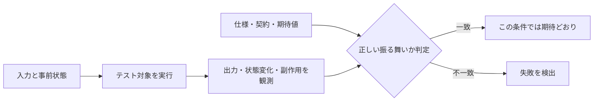
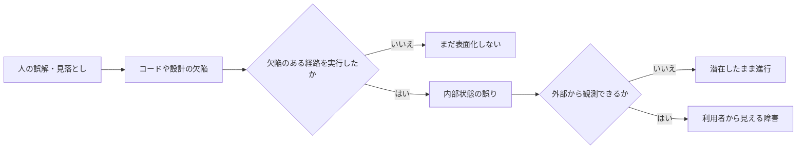
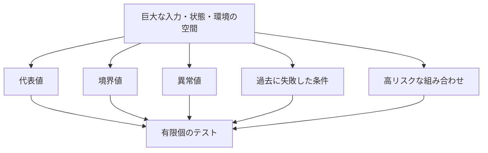
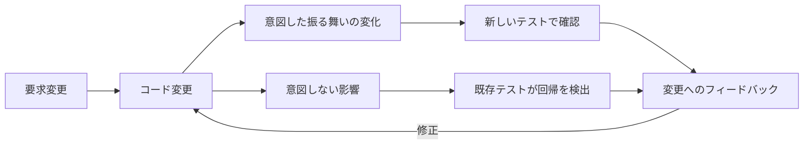
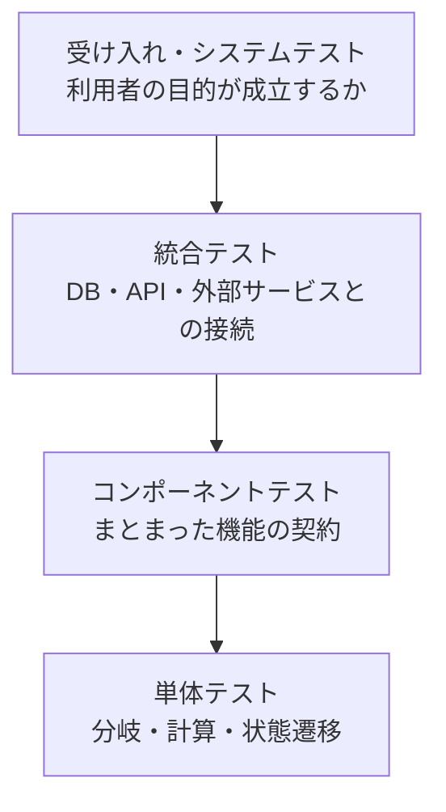
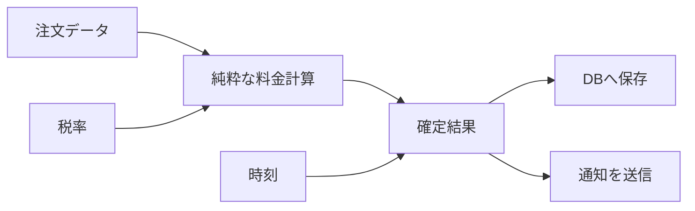
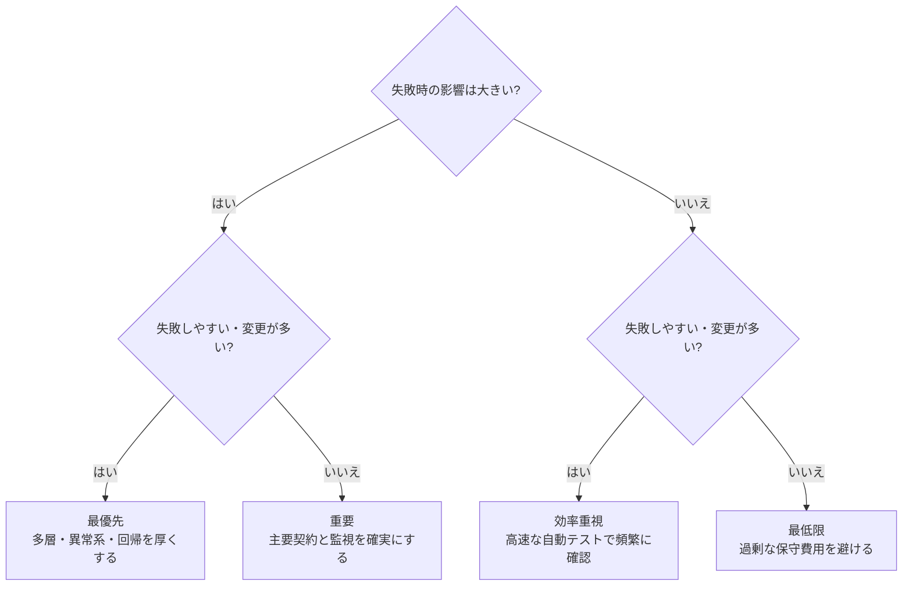
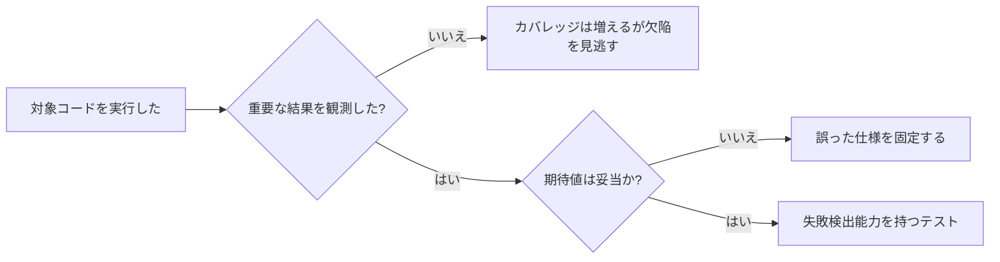
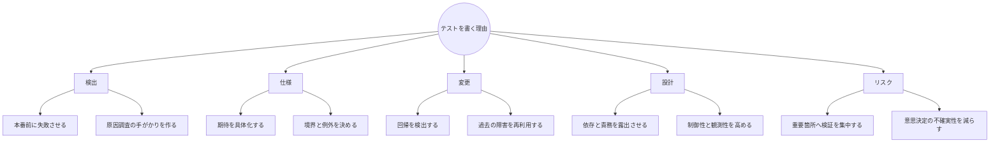

プログラムが今、目の前で動いている。

それでも、なぜテストを書くのでしょうか。

よくある答えは「バグを見つけるため」です。間違いではありません。しかし、この説明だけでは、次の疑問に十分答えられません。

- 自分で一度動かしたのに、なぜ自動テストも必要なのか
- 型チェックやコードレビューがあるのに、なぜ実行するのか
- テストを書いてもバグが残るなら、何を達成しているのか
- どこまでテストすれば十分なのか
- テストコードの保守費用を払う価値はあるのか

ソフトウェア工学から見ると、テストは品質を証明する儀式ではありません。

**テストとは、ソフトウェアに入力を与え、振る舞いを観測し、期待とのずれを調べることで、不確実性を減らす工学的な活動です。**

この記事では、テストを書く理由を「検出」「仕様」「変更」「設計」「リスク」の5つから説明します。

:::message
この記事でいうテストには、開発者が書く自動テストだけでなく、統合テスト、システムテスト、受け入れテスト、探索的テストも含みます。
:::

## テストは小さな実験である

テストには、少なくとも4つの要素があります。

1. **入力**: どの条件を与えるか
2. **実行**: 対象をどの状態で動かすか
3. **観測**: 何を結果として取得するか
4. **判定**: その結果を何と比較するか



重要なのは、プログラムを実行しただけではテストにならないことです。

たとえばAPIへリクエストを送り、`200 OK`が返ったとします。しかし、本来作成されるべきデータが保存されていないかもしれません。残高が二重に減っているかもしれません。権限のない利用者が操作できているかもしれません。

何を観測し、何を正しいとするかが必要です。この正しさの判定基準を**テストオラクル**と呼びます。Barrらは、入力に対して観測された振る舞いが正しいかを判別する問題を「オラクル問題」として整理しています。

つまり、良いテストを書くには、コードの書き方だけでなく、**何が正しいのかを説明する能力**が必要です。

## 1. 欠陥を利用者より先に失敗させる

コードの中に誤りがあっても、常に利用者から見える障害になるとは限りません。



月末だけ実行される処理、0件のときだけ壊れる集計、特定の順序で操作したときだけ起きる競合など、欠陥は条件がそろうまで潜伏します。

テストの第一の役割は、その条件を意図的に作り、**本番より前に失敗を観測すること**です。

ここで、テストが直接見つけるのは多くの場合「欠陥そのもの」ではなく「期待と異なる振る舞い」です。失敗したテストを手がかりに原因を調べ、コード、設計、仕様、環境のどこに問題があるかを特定します。

### テストはバグがないことを証明しない

Dijkstraが指摘したように、テストは欠陥の存在を示せても、一般には欠陥が存在しないことまでは示せません。

理由は単純です。現実のソフトウェアには、入力、状態、時刻、権限、外部サービス、実行順序などの組み合わせがあります。その全件を実行することはほぼ不可能です。



したがって、テストの目標は「全部試す」ではありません。**失敗を見つける可能性と、失敗した場合の影響が大きい条件を選ぶこと**です。

## 2. 曖昧な要求を、実行できる期待へ変える

「正しく計算する」「安全に更新する」「高速に応答する」という要求は、そのままではテストできません。

テストを書くと、曖昧な言葉を具体化せざるを得なくなります。

たとえば、送料の仕様が次だったとします。

> 5kg未満は500円、5kg以上は800円。プレミアム会員は無料。

この文章から、少なくとも次のテストが導けます。

```ts
describe("calculateShippingFee", () => {
  test("4.9kgの通常会員は500円", () => {
    expect(calculateShippingFee(4.9, false)).toBe(500);
  });

  test("境界値の5.0kgは800円", () => {
    expect(calculateShippingFee(5.0, false)).toBe(800);
  });

  test("プレミアム会員は重量にかかわらず無料", () => {
    expect(calculateShippingFee(20.0, true)).toBe(0);
  });
});
```

ここでテストは、単に実装を確認しているだけではありません。

- 「未満」と「以上」の境界は5.0kgである
- プレミアム特典は重量条件より優先される
- 金額は円単位の整数で返る

という判断を、実行可能な形で残しています。

一方、仕様に書かれていないことも見えてきます。

- 重量が0kgや負数ならどうするか
- 小数の丸めは必要か
- 会員情報を取得できない場合はどうするか
- 料金改定前に作成した注文はどちらの料金か

**テストを書けない箇所は、期待が決まっていない箇所かもしれません。**

この意味でテスト設計は、要求分析と設計レビューでもあります。

## 3. 変更が壊したものを知らせる

ソフトウェアは完成後も変更されます。機能追加、リファクタリング、依存ライブラリ更新、性能改善、障害修正が続きます。

問題は、変更の影響範囲を人間が完全には把握できないことです。



昨日まで動いていた機能が変更によって壊れることを**回帰**と呼びます。既存テストを再実行する回帰テストは、変更が他の振る舞いへ悪影響を与えていないかを調べます。

RothermelとHarroldは、回帰テストを、変更が正しく、既存部分へ悪影響を与えていないという確信を得るための保守活動として扱っています。

自動テストの価値は、一回目より二回目以降に大きくなります。

- 障害を一度再現するテストを書く
- 原因を修正する
- 以後のすべての変更でそのテストを実行する

こうすると、過去の障害は単なる記憶ではなく、継続的に検査される条件になります。

**テストスイートは、システムが過去に何を約束し、どこで失敗したかを蓄積した変更検知器です。**

## 4. 異なる大きさのテストで、異なる失敗を探す

小さいテストと大きいテストは競合しません。観測できる問題が異なります。



|レベル|主に分かること|見逃しやすいこと|
|---|---|---|
|単体テスト|分岐、計算、例外、局所的な状態遷移|実DBやネットワークとの不整合|
|コンポーネントテスト|公開インターフェース、機能内の協調|システム全体の設定や配線|
|統合テスト|境界をまたぐデータ形式、トランザクション、接続|利用者の業務目的が成立するか|
|システム・受け入れテスト|本番に近い流れ、利用者価値、主要シナリオ|内部の細かな分岐と原因箇所|

単体テストだけがすべて成功しても、接続先のカラム名が違えばシステムは動きません。逆に、画面を通したシステムテストだけでは、失敗時にどの分岐が原因か分かりにくく、実行も遅くなります。

そのため、一般には次の組み合わせが有効です。

- 多数の高速で局所的なテスト
- 境界ごとの統合テスト
- 少数の重要な利用者シナリオ
- 自動化しにくい未知を探す探索的テスト

テスト数をきれいな比率に合わせることより、**そのシステムにあるリスクを各レベルで観測できること**が重要です。

## 5. テストしやすさは、設計の問題を露出させる

次のコードはテストしにくい構造です。

```ts
async function closeOrder(orderId: string) {
  const now = new Date();
  const order = await productionDatabase.find(orderId);
  const rate = await externalTaxApi.getRate(order.country);
  const total = order.subtotal * (1 + rate);
  await productionDatabase.save({ ...order, total, closedAt: now });
  await mailService.send(order.customerEmail, "注文を確定しました");
}
```

時刻、データベース、税率API、メール送信が一つに結合されています。計算だけを試すにも外部環境が必要で、失敗原因も切り分けにくくなります。

テストしやすくするには、決定と副作用を分けます。



こうすると、料金計算は多数の条件を高速に試せます。DB保存とメール送信は、それぞれの境界で統合テストできます。

テストが難しいとき、問題はテスト技法ではなく、次の設計上の性質にあるかもしれません。

- 責務が多すぎる
- 依存先が隠れている
- 入力と出力が観測できない
- グローバル状態へ依存している
- 非決定的な時刻や乱数を制御できない
- 境界と契約が曖昧である

テストは設計を自動的に良くする魔法ではありません。しかし、**制御できないもの、観測できないもの、分離できないものを可視化する圧力**になります。

## 6. テストはリスクに対する投資である

すべてのコードを同じ強さでテストする必要はありません。

ソフトウェア工学では、品質活動を費用と損失のトレードオフとして考えます。簡略化すれば、優先度は次の2軸で考えられます。

```text
リスクの大きさ ≒ 失敗する可能性 × 失敗したときの影響
```



たとえば、決済金額、権限判定、個人情報削除、医療機器の制御は、失敗時の影響が大きいため厚い検証が必要です。一方、期間限定の社内デモに、長期間保守する大規模テストスイートを作るのは合理的でない場合があります。

優先してテストする候補は次です。

- 失敗時の被害が大きい処理
- 頻繁に変更される処理
- 条件分岐や状態の組み合わせが多い処理
- 外部システムとの境界
- 過去に障害が起きた処理
- 境界値、空値、最大値、期限、権限
- 人間が手作業で確認し続けるのが難しい反復処理

「テストを書くか、書かないか」という二択ではありません。**どのリスクへ、どのテスト技法を、どの深さで適用するか**を決めます。

## カバレッジ100%でも安心できない

コードカバレッジは、テスト実行時にどの文や分岐を通ったかを示します。未実行箇所を見つけるには有用ですが、テストの正しさや十分さを直接示すものではありません。

```ts
test("送料を計算できる", () => {
  calculateShippingFee(5.0, false);
});
```

このテストが対象コードをすべて通っても、結果を一つも判定していません。実装が500円を返しても800円を返しても成功します。



カバレッジは「どこを試していないか」を問う指標です。「このテストは重要な欠陥を検出できるか」には別の検討が必要です。

有効なテストには、少なくとも次が求められます。

- 失敗させたい欠陥の仮説がある
- 重要な出力、状態、副作用を観測する
- 境界や異常条件を含む
- 実装の内部手順ではなく、守るべき振る舞いを判定する
- 実装を意図的に壊したとき失敗する

## 自動テストだけで品質は作れない

テストには構造的な限界があります。選んだ条件しか実行せず、判定基準そのものが誤っている可能性もあります。

そのため、品質は複数の活動で作ります。

|活動|主な役割|
|---|---|
|要求レビュー|作るもの自体の誤解を減らす|
|設計・コードレビュー|実行前に欠陥や保守上の問題を探す|
|型検査・静的解析|特定種類の不整合を広く機械検出する|
|動的テスト|実行時の振る舞いと相互作用を観測する|
|セキュリティ検査|脅威モデルに基づき脆弱性を探す|
|監視・ログ・アラート|本番でしか現れない事象を検出する|
|障害分析|再発条件と根本原因を学習する|

NISTのSecure Software Development Frameworkも、脆弱性を減らす活動を単一のテスト工程に限定せず、開発ライフサイクル全体の実践として整理しています。

テストは重要ですが、品質保証の全部ではありません。

## では、どんなテストから書くか

迷ったら、次の順で考えます。

### 1. 守るべき振る舞いを書く

```text
この条件で、誰が、何をすると、何が起きるべきか
```

### 2. 失敗すると困る順に並べる

金銭、権限、データ消失、安全、復旧不能な処理から優先します。

### 3. 正常値より境界を見る

`1`だけでなく`0`、最大値、期限直前と直後、権限ありとなし、空配列と大量データを確認します。

### 4. 一度起きた障害を回帰テストにする

障害を再現する最小テストを先に作り、修正後も残します。

### 5. 最小のレベルで速く失敗させる

計算規則なら単体、SQLやトランザクションなら統合、購入完了ならシステムテストというように、目的に合う最小範囲を選びます。

### 6. テスト自体の品質を保つ

- 高速である
- 同じ条件なら同じ結果になる
- 失敗理由を読み取れる
- 他テストの順序へ依存しない
- 重要でない実装詳細へ過剰に結合しない

壊れやすく、遅く、結果が不安定なテストは、やがて無視されます。テストコードも保守対象のソフトウェアです。

## なぜテストを書くのか

ここまでの議論をまとめます。



テストを書くのは、コードが正しいと信じるためではありません。

**どの条件を確認できていて、どの条件はまだ分からないかを明らかにし、変更を続けるためです。**

テストが一つ成功したとき、言えるのは「この条件では、観測した範囲が期待と一致した」です。それは完全な証明ではありません。しかし、根拠のない安心よりはるかに強い情報です。

ソフトウェア工学におけるテストの価値は、バグの個数だけでは測れません。

- 要求の曖昧さを発見した
- 変更の影響を数分で確認できた
- 障害の再発を防いだ
- 設計上の密結合を見つけた
- リリース判断の根拠を増やした

これらすべてが、テストによって得られる工学的な成果です。

## 参考文献

- IEEE Computer Society, [Guide to the Software Engineering Body of Knowledge (SWEBOK Guide), Version 4.0](https://www.computer.org/education/bodies-of-knowledge/software-engineering/v4)
- E. W. Dijkstra, [Notes on Structured Programming (EWD249)](https://www.cs.utexas.edu/~EWD/transcriptions/EWD02xx/EWD249/EWD249.html)
- E. T. Barr, M. Harman, P. McMinn, M. Shahbaz, S. Yoo, [The Oracle Problem in Software Testing: A Survey](https://doi.org/10.1109/TSE.2014.2372785), IEEE Transactions on Software Engineering, 2015.
- G. Rothermel, M. J. Harrold, [Analyzing Regression Test Selection Techniques](https://doi.org/10.1109/32.536955), IEEE Transactions on Software Engineering, 1996.
- NIST, [Secure Software Development Framework (SSDF) Version 1.1, SP 800-218](https://csrc.nist.gov/pubs/sp/800/218/final), 2022.

:::message
本記事は「E大学 ソフトウェア工学部」の講義コンテンツとして作成しました。個別のフレームワークの使い方ではなく、技術を選ぶための基礎概念を扱っています。
:::
